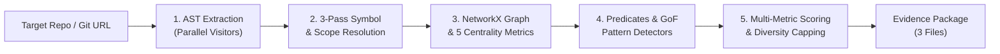

# ZENITH ⚡

> **Zero-hallucination Evidence & Network Intelligence for Token-optimal Heuristics**
> *Deterministic Static Analysis & Pre-LLM Semantic Graph Engine for Python*

**ZENITH** (Repo-Miner) analyzes Python codebases by constructing an AST-derived, graph-resolved semantic knowledge fabric. Instead of non-deterministic LLM parsing or flat lexical search, ZENITH applies deterministic graph algorithms (PageRank, Betweenness Centrality, $k$-core decomposition) to distill any repository into an audit-ready **Evidence Package** in seconds.

---

## 🚀 Key Features

- **⚡ Blazing Fast**: Scans 2,500+ Python files in **<65 seconds** via parallel multi-threaded AST extraction.
- **🔍 323 Cataloged Capabilities**: 100% coverage across language idioms, GoF patterns, architectural styles, concurrency, dead code, and anti-patterns.
- **📊 5 Graph Centrality Metrics**: PageRank, Betweenness, $k$-Core, In-Degree, and Out-Degree to separate core architecture from peripheral scripts.
- **🔒 Zero-Hallucination Ground Truth**: Every finding is anchored in immutable, SHA-256 hashed AST fact references.
- **📦 Clean 3-File Evidence Package**: Produces strictly `metadata.json`, `knowledge.json`, and `top_learnings.json`.

---

## 🏗️ Architecture Pipeline



---

## 📦 Output Contract (The 3 Files)

```text
scan-output/
├── metadata.json         # Scan provenance, git commit SHA, and stage performance profiling
├── knowledge.json        # Exhaustive semantic database (AST facts, symbol graph, findings)
└── top_learnings.json    # Prioritized Top 25 repository architectural learnings
```

---

## 🛠️ Installation & Quickstart

### Prerequisites
- Python >= 3.10

### 1. Install Dependencies
```bash
pip install -r requirements.txt
pip install -e .
```

### 2. Run via CLI (`zenith` or `repo-miner`)

```bash
# Check version
zenith version

# Scan local repository (positional or flag output)
zenith scan . output_dir -v

# Scan directly from a remote GitHub repository
zenith scan https://github.com/langchain-ai/langgraph langgraph_output --mode fast
```

### 3. Run via Python API
```python
from src.pipeline.orchestrator import ScanPipeline

pipeline = ScanPipeline(target_dir="/path/to/repo", mode="standard")
pipeline.run(output_dir="./scan-output")
```

---

## 📂 Project Structure

```text
repo-miner/
├── cli/                         # Root CLI package (main.py, argument parsing, git cloning)
├── docs/                        # Enterprise architecture, contract, & graph documentation
│   ├── ARCHITECTURE.md
│   ├── CAPABILITIES.md
│   ├── GRAPH_ANALYTICS.md
│   └── OUTPUT_CONTRACT.md
├── src/                         # Core engine sub-packages
│   ├── core/                    # AST parsing, fact extraction, logging, fact models
│   ├── repository/              # File discovery, git provenance, path filtering
│   ├── resolution/              # 3-pass global symbol & relationship linking
│   ├── graph/                   # NetworkX MultiDiGraph, analytics, projections
│   ├── analysis/                # Predicate engine, GoF detectors, dead code detection
│   ├── catalog/                 # Capabilities YAML catalog and registry
│   ├── pipeline/                # Modular stages, context, and ScanPipeline orchestrator
│   └── output/                  # Models, TopLearningsBuilder, EvidencePackageWriter
└── tests/
    ├── unit/                    # Fast isolated component unit tests
    ├── integration/             # Multi-component and ranking regression tests
    └── e2e/                     # End-to-end repository scan & CLI tests
```

---

## 🧪 Testing

Run the full automated test suite:

```bash
python3 -m unittest discover -s tests -v
```

---

## 📄 License

Apache 2.0
