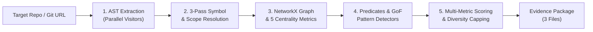

# ZENITH

<p align="center">
  <strong>Zero-hallucination Evidence & Network Intelligence for Token-optimal Heuristics</strong><br>
  <em>Deterministic Static Analysis & Pre-LLM Semantic Graph Engine for Python</em>
</p>

<p align="center">
  
  
  
  
</p>

---

## The Problem ZENITH Solves

Modern LLM coding agents and RAG pipelines struggle with **code hallucinations** and **context window bloat**:
* **Vector Embeddings & Grep** miss multi-file inheritance chains, factory registrations, and caller graphs.
* **Feeding Full Repos to LLMs** wastes millions of tokens on boilerplate, utility scripts, and test mocks.

**ZENITH solves this deterministically.** It compiles Python codebases into a typed directed graph, applies **PageRank, Betweenness Centrality, and k-Core Decomposition**, and mines **323 architectural capabilities** to emit an immutable, audit-ready **Evidence Package** in seconds.

---

## Key Features

- **High Performance**: Scans large multi-file codebases in seconds via parallel multi-threaded AST workers.
- **323 Cataloged Capabilities**: Coverage across language idioms, GoF design patterns, architectural styles, concurrency, dead code, and SRP risks.
- **5 Graph Centrality Metrics**: PageRank, Betweenness Centrality, k-Core, In-Degree, and Out-Degree to separate core architecture from peripheral scripts.
- **Zero-Hallucination Ground Truth**: Every finding is anchored in immutable, SHA-256 hashed AST fact references with exact file paths and line numbers.
- **Clean 3-File Evidence Package**: Produces strictly `metadata.json`, `knowledge.json`, and `top_learnings.json`.

---

## Architecture Pipeline



---

## Output Contract (The 3 Files)

Every scan produces a deterministic, audit-ready 3-file Evidence Package:

```text
scan-output/
├── metadata.json         # Scan provenance, git commit SHA, and stage performance profiling
├── knowledge.json        # Exhaustive semantic database (AST facts, symbol graph, findings)
└── top_learnings.json    # Prioritized Top 25 repository architectural learnings
```

### Sample Top Learning (`top_learnings.json`):
```json
{
  "rank": 1,
  "capability_id": "factory_registry",
  "name": "Factory Registry Pattern",
  "category": "architectural_styles",
  "score": 8.74,
  "explanation": "Discovered extensible factory pattern on 'BaseCheckpointSaver' with 12 dynamic implementations.",
  "source_locations": [
    {
      "file": "libs/checkpoint/langgraph/checkpoint/base/__init__.py",
      "line": 177
    }
  ]
}
```

---

## Installation & Quickstart

### Prerequisites
* Python >= 3.10

### 1. Install from Source
```bash
git clone https://github.com/manideep-malyala/zenith.git
cd zenith
pip install -r requirements.txt
pip install -e .
```

### 2. CLI Usage (`zenith`)

```bash
# Verify installation
zenith version

# Scan local repository (verbose mode)
zenith scan . ./scan-output -v

# Scan quietly in CI/CD pipeline
zenith scan . ./scan-output -q

# Scan directly from a remote GitHub repository
zenith scan https://github.com/langchain-ai/langgraph ./langgraph-output --mode fast
```

### 3. Python SDK Usage

```python
from src.pipeline.orchestrator import ScanPipeline

pipeline = ScanPipeline(target_dir="./my-project", mode="standard")
pipeline.run(output_dir="./scan-output")
```

---

## Project Structure

```text
zenith/
├── cli/                         # Root CLI package (main.py, argument parsing, git cloning)
├── docs/                        # Architecture, contract, & graph documentation
│   ├── ARCHITECTURE.md          # Full systems design and subsystem mapping
│   ├── CAPABILITIES.md          # Catalog of 323 declarative capabilities
│   ├── GRAPH_ANALYTICS.md       # Centrality math, PageRank, and scoring formulas
│   └── OUTPUT_CONTRACT.md       # Evidence Package schemas and data models
├── src/                         # Core engine sub-packages
│   ├── core/                    # AST parsing, fact extraction, logging, AST token models
│   ├── repository/              # File discovery, git provenance, path filtering
│   ├── resolution/              # 3-pass global symbol & relationship linking
│   ├── graph/                   # NetworkX MultiDiGraph, analytics, projections
│   ├── analysis/                # Predicate engine, GoF detectors, dead code detection
│   ├── catalog/                 # Capabilities YAML catalog and registry
│   ├── pipeline/                # Modular stages, context, and ScanPipeline orchestrator
│   └── output/                  # Models, TopLearningsBuilder, EvidencePackageWriter
└── tests/
    ├── unit/                    # Fast isolated component unit tests
    ├── integration/             # Multi-component and ranking regression tests
    └── e2e/                     # End-to-end repository scan & CLI tests
```

---

## Automated Testing

Run the full test suite (143 unit, integration, and E2E tests):

```bash
python3 -m unittest discover -s tests -v
```

---

## License

Apache 2.0
