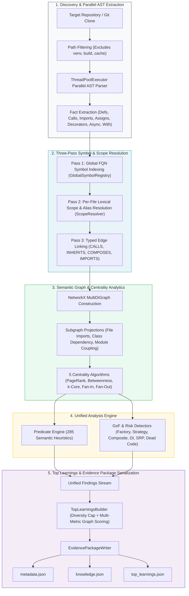
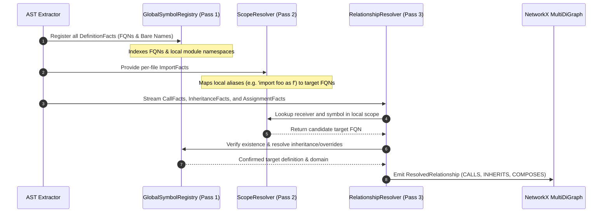
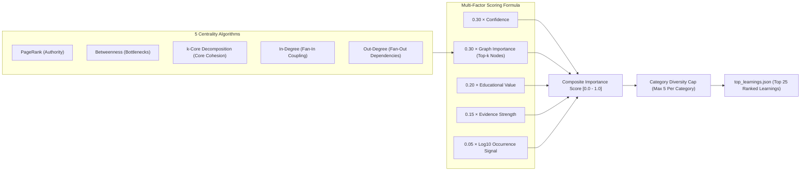

# ZENITH Architecture & System Design

ZENITH is a deterministic static analysis and semantic graph intelligence engine for Python repositories. Instead of non-deterministic heuristic guessing or flat keyword searches, ZENITH constructs an AST-derived, graph-resolved semantic knowledge fabric and calculates graph centrality metrics to surface verifiable architectural patterns and risks.

---

## 1. End-to-End Pipeline Flow

The scanning engine executes in **5 linear phases**:

---

## 2. Three-Pass Symbol & Scope Resolution Sequence

To eliminate ambiguity across imported modules, aliases, and nested scopes, ZENITH performs a deterministic 3-pass resolution protocol:

---

## 3. Multi-Metric Graph Analytics & Scoring Model

To rank the most important architectural patterns, ZENITH combines 5 NetworkX centrality metrics with evidence strength and educational value:

---

## 4. Layered Subsystems in `src/`

| Subsystem | Primary Responsibilities | Key Modules |
|---|---|---|
| **`src/core/`** | AST Parsing, Fact extraction, logging, AST token models | [`parser.py`](file:///Users/manideepmalyala/Documents/project-z/repo-miner/src/core/parser.py), [`models.py`](file:///Users/manideepmalyala/Documents/project-z/repo-miner/src/core/models.py), [`extractor.py`](file:///Users/manideepmalyala/Documents/project-z/repo-miner/src/core/extractor.py) |
| **`src/repository/`** | File discovery, ignore rules, Git provenance, metadata scanner | [`discovery.py`](file:///Users/manideepmalyala/Documents/project-z/repo-miner/src/repository/discovery.py), [`path_filters.py`](file:///Users/manideepmalyala/Documents/project-z/repo-miner/src/repository/path_filters.py), [`git.py`](file:///Users/manideepmalyala/Documents/project-z/repo-miner/src/repository/git.py) |
| **`src/resolution/`** | 3-pass symbol registry, per-file scope mapping, typed edge resolution | [`registry.py`](file:///Users/manideepmalyala/Documents/project-z/repo-miner/src/resolution/registry.py), [`symbol_resolver.py`](file:///Users/manideepmalyala/Documents/project-z/repo-miner/src/resolution/symbol_resolver.py), [`relationship_resolver.py`](file:///Users/manideepmalyala/Documents/project-z/repo-miner/src/resolution/relationship_resolver.py) |
| **`src/graph/`** | MultiDiGraph constructor, 5 centrality algorithms, projections | [`builder.py`](file:///Users/manideepmalyala/Documents/project-z/repo-miner/src/graph/builder.py), [`analytics.py`](file:///Users/manideepmalyala/Documents/project-z/repo-miner/src/graph/analytics.py), [`projections/`](file:///Users/manideepmalyala/Documents/project-z/repo-miner/src/graph/projections/) |
| **`src/analysis/`** | Semantic PredicateEngine (285 heuristics) & GoF/Risk Pattern Detectors | [`predicates/`](file:///Users/manideepmalyala/Documents/project-z/repo-miner/src/analysis/predicates/), [`detectors/`](file:///Users/manideepmalyala/Documents/project-z/repo-miner/src/analysis/detectors/) |
| **`src/catalog/`** | 323 capabilities catalog and typed capability registry | [`capabilities.yaml`](file:///Users/manideepmalyala/Documents/project-z/repo-miner/src/catalog/capabilities.yaml), [`registry.py`](file:///Users/manideepmalyala/Documents/project-z/repo-miner/src/catalog/registry.py) |
| **`src/pipeline/`** | Multi-threaded scan orchestrator coordinating all phases | [`orchestrator.py`](file:///Users/manideepmalyala/Documents/project-z/repo-miner/src/pipeline/orchestrator.py) |
| **`src/output/`** | Top learnings ranking, diversity capping, and Evidence Package writer | [`top_learnings.py`](file:///Users/manideepmalyala/Documents/project-z/repo-miner/src/output/top_learnings.py), [`writer.py`](file:///Users/manideepmalyala/Documents/project-z/repo-miner/src/output/writer.py) |
