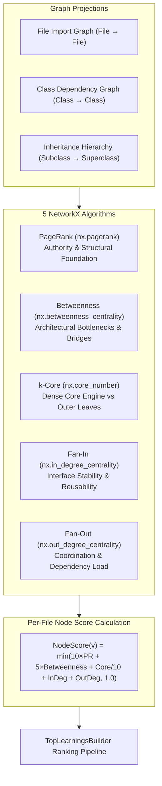
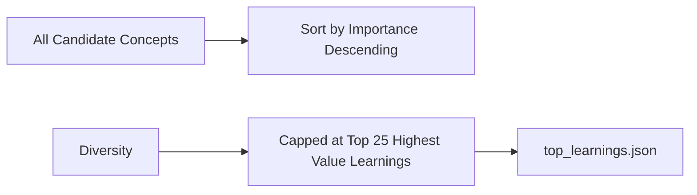

# Graph Analytics & Ranking Formula

ZENITH leverages NetworkX to construct multi-relational graph projections of the target codebase and calculate 5 graph centrality metrics to separate foundational architecture from peripheral utilities.

---

## 1. Graph Analytics Architecture

---

## 2. The 5 Graph Centrality Metrics

| Metric | NetworkX API | Architectural Role in Codebases |
|---|---|---|
| **PageRank** | `nx.pagerank()` | Measures authority and structural depth across the dependency web. |
| **Betweenness Centrality** | `nx.betweenness_centrality()` | Identifies architectural bottlenecks and bridge modules connecting subsystems. |
| **$k$-Core Decomposition** | `nx.core_number()` | Isolates the cohesive core engine cluster from outer peripheral scripts. |
| **In-Degree (Fan-In)** | `nx.in_degree_centrality()` | Measures interface stability (how many files depend on this module). |
| **Out-Degree (Fan-Out)** | `nx.out_degree_centrality()` | Measures orchestration complexity (how many downstream components this calls). |

---

## 3. Top Learnings Multi-Factor Ranking Formula

For each candidate concept $C$, its importance is calculated as:

$$\text{Score}(C) = 0.30 \cdot \text{Confidence} + 0.30 \cdot \text{GraphImportance} + 0.20 \cdot \text{EducationalValue} + 0.15 \cdot \text{EvidenceStrength} + 0.05 \cdot \text{FrequencySignal}$$

### Mathematical Components:
- **`GraphImportance`**: Average $\text{NodeScore}$ of the top 5 representative files implementing concept $C$.
- **`EducationalValue`**: Pedagogical weight defined declaratively in [`capabilities.yaml`](file:///Users/manideepmalyala/Documents/project-z/repo-miner/src/catalog/capabilities.yaml) (0.10 for syntax to 0.95 for advanced architecture).
- **`EvidenceStrength`**: $1.0$ if backed by precise file and line numbers, $0.5$ if heuristic.
- **`FrequencySignal`**: Logarithmic occurrence dampening:
  $$\text{FrequencySignal} = \min\left(\frac{\log_{10}(1 + \text{Occurrences})}{3.0},\; 1.0\right)$$
  *(Prevents 10,000 variable assignments from overpowering 30 critical architectural patterns).*

---

## 4. Diversity & Pruning Constraints

