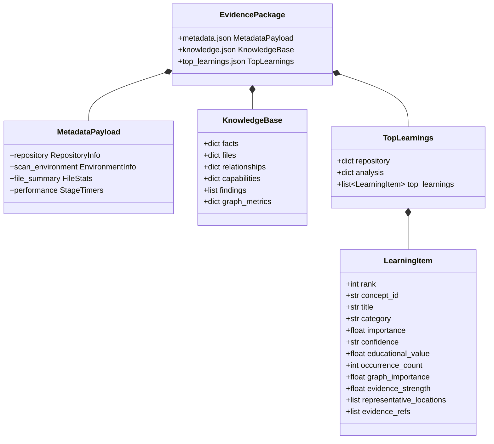

# Evidence Package Specification & Output Contract

Every ZENITH scan produces strictly **three files** in the target destination directory:

```text
scan-output/
├── metadata.json         # Scan provenance, commit SHA, and phase profiling
├── knowledge.json        # Exhaustive semantic database (facts, graph edges, findings)
└── top_learnings.json    # Prioritized Top 25 repository architectural learnings
```

---

## 1. Evidence Package Data Structure



---

## 2. `metadata.json` (Scan Provenance & Audit)

Contains execution telemetry, repository commit hashes, discovery statistics, and performance profiling:

```json
{
  "repository": {
    "name": "langgraph",
    "commit_sha": "81bf17b23123e4ef8b9d5f49fa09a0122fc2edd1",
    "branch": "main",
    "origin_url": "https://github.com/langchain-ai/langgraph.git"
  },
  "scan_environment": {
    "python_version": "3.14.2",
    "timestamp_utc": "2026-09-04T01:54:04Z",
    "platform": "Darwin"
  },
  "file_summary": {
    "total_files": 512,
    "python_files_found": 452,
    "non_python_files": 60,
    "python_files_scanned": 452,
    "python_files_excluded": 0,
    "python_files_parsed_successfully": 452,
    "python_files_with_parse_errors": 0
  },
  "performance": {
    "parsing_seconds": 0.12,
    "fact_extraction_seconds": 1.45,
    "resolution_seconds": 2.10,
    "total_seconds": 32.78
  }
}
```

---

## 3. `knowledge.json` (Complete Semantic Evidence Base)

The exhaustive, deterministic graph and semantic fact database for the entire repository:

- `facts`: All extracted AST facts (`definitions`, `calls`, `imports`, `assignments`, `asyncs`, `withs`, `decorators`).
- `files`: File mapping between absolute system paths and repository relative paths.
- `relationships`: All resolved directed edges (`CALLS`, `INHERITS`, `COMPOSES`, `INSTANTIATES`, `IMPORTS`).
- `capabilities`: Full dictionary of 323 indexed capabilities and operations.
- `findings`: All candidate findings generated across the entire repository.
- `graph_metrics`: Complete 5-metric graph analysis computed for every node in the repository.

---

## 4. `top_learnings.json` (Prioritized Architectural Intelligence)

Contains ranked architectural concepts formatted for direct human and downstream LLM consumption:

```json
{
  "repository": {
    "name": "langgraph",
    "commit": "81bf17b23123e4ef8b9d5f49fa09a0122fc2edd1"
  },
  "analysis": {
    "candidate_count": 218,
    "selected_count": 25
  },
  "top_learnings": [
    {
      "concept_id": "dependency_injection",
      "title": "Dependency Injection",
      "category": "patterns",
      "importance": 0.887,
      "confidence": "HIGH",
      "educational_value": 0.95,
      "occurrence_count": 34,
      "graph_importance": 0.842,
      "evidence_strength": 1.0,
      "representative_locations": [
        {
          "file": "libs/langgraph/langgraph/pregel/loop.py",
          "line": 154
        }
      ],
      "evidence_refs": [
        "c0b1a2f3e4d5"
      ],
      "rank": 1
    }
  ]
}
```
